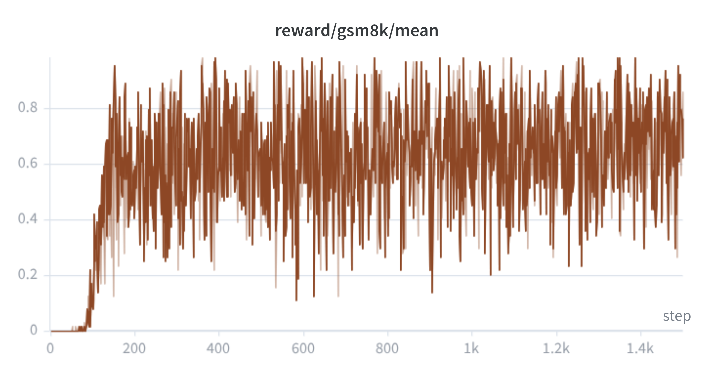
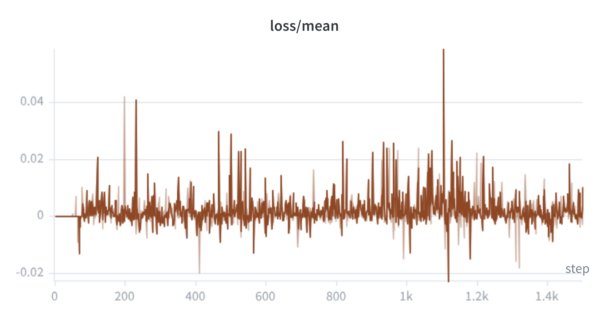
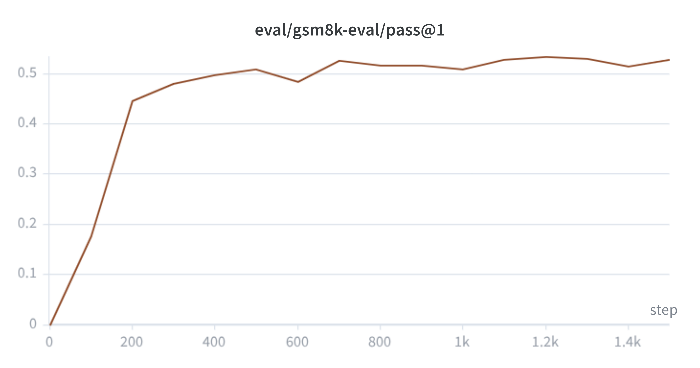

# GSM8K-RL

This is part of a series of small projects I'm working on to brush up on RL concepts and get familiar with the modern LLM training stack.

In this project I implemented GRPO (Group Relative Policy Optimization) on GSM8K - grade school math problems. The idea is to fine-tune a small language model using RL, where the reward signal is simply exact match on the final numeric answer.

This was also my first time working with [verifiers](https://github.com/PrimeIntellect-ai/verifiers) and [prime-rl](https://github.com/PrimeIntellect-ai/prime-rl). I really liked the interface they've built - you just define your environment and reward function with verifiers, write a TOML config, and prime-rl handles the rest of the training loop. It abstracts away a lot of the complexity I would have otherwise had to wire up manually with TRL.

I ended up using Qwen2.5-0.5B-Instruct with W&B for logging and prime-rl's GRPO trainer.

## Learnings

**1.** I initially used Qwen3-1.7B, which was already able to solve a lot of GSM8K problems out of the box. Since there wasn't much variance within a group - all rollouts were getting the same high reward - the advantage became 0. The model had nothing to learn. I decided to switch to a smaller, weaker model where there was enough variance to actually learn from.

**2.** When I ran training with the smaller model, I realized that because of a simple system prompt ("give the final answer after ####, example: #### 42"), the model was just directly outputting the answer in the format without doing any reasoning. As a result most groups had identical rewards, advantage was 0. So I updated the prompt to explicitly require step-by-step reasoning before the answer.

**3.** Earlier runs were also unstable due to a high learning rate (`lr=1e-5`). I also noticed large grad norm values during training. So I dropped the lr to `5e-6` and added `max_norm=0.5` gradient clipping, which kept training stable.

**4.** Set up checkpoint saving before starting the run.

## Training Curves

**Reward (train)**

**Loss**

**Eval pass@1**

## Weights

The trained LoRA weights are available on HuggingFace: [saad1926q/qwen2.5-0.5b-gsm8k](https://huggingface.co/saad1926q/qwen2.5-0.5b-gsm8k)

Checkpoints saved: `step_1225`, `step_1300`, `step_1500`. The peak eval score was at step 1200 (53.45%) but that checkpoint was not saved due to my dumb ahh not setting up checkpoint saving before starting the run. `step_1225` is the closest available.
